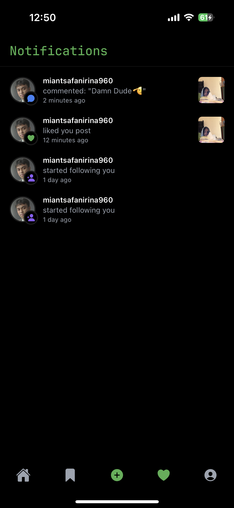

# InstaGreen 🌿

InstaGreen is an Instagram clone built using **React Native** and **Expo**, created to deepen my understanding of mobile app development and demonstrate my full-stack skillset. This project integrates **Convex** as a backend and **Clerk** for seamless user authentication and management.

---

## 📱 Features

- User authentication and session handling with Clerk
- Real-time database and backend functions powered by Convex
- Post creation with image uploads
- Like and comment functionalities
- Scrollable feed of user posts
- User profile with post history
- Responsive UI built with React Native components

---

## 🛠️ Technologies Used

- [React Native](https://reactnative.dev/)
- [Expo](https://expo.dev/)
- [Convex](https://www.convex.dev/)
- [Clerk](https://clerk.dev/)

---

## 📸 Screenshots

  
  
  

  
  
  

  
  
  

